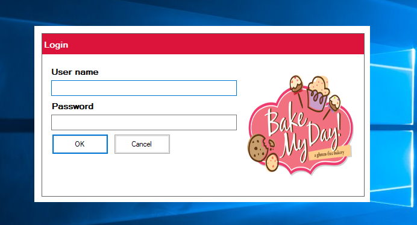

# Bakeshop Inventory System in VB.Net and MS Access Database

### Description

<i>The Bakeshop Inventory System is a software-based system specially designed for a Bakeshop business and for the inventory process. This system will be able to track the daily, weekly, monthly, and yearly inventory of products.</i>

### Features

<ul>
  <li><strong>Products </strong>
    <ul>
      <li><strong>Add Product</strong></li>
      <li><strong>Update Product</strong></li>
      <li><strong>List of Products</strong></li>
      <li><strong>Delete Products</strong></li>
    </ul>
  </li>
<li><strong>Transactions</strong>
  <ul>
    <li><strong>Stock-In Products</strong></li>
    <li><strong>List of Receive Products</strong></li>
    <li><strong>Delete Receive Products</strong></li>
    <li><strong>Stock-Out Products</strong></li>
    <li><strong>List of Sold Products</strong></li>
    <li><strong>Delete Sold Products</strong></li>
  </ul>
</li>
<li><strong>Manage Users</strong>
<ul><li><strong>Add User</strong></li>
<li><strong>Update User</strong></li>
<li><strong>List of Users</strong></li>
<li><strong>Delete User</strong></li>
</ul></li>
<li><strong>Inventory Reports </strong></li>
<li><strong>Login and Logout</strong></li>
</ul>

Visit [sourcecodester.com](https://www.sourcecodester.com/visual-basic-net/12634/bakeshop-inventory-system-vbnet-and-ms-access-database.html) for more information about this project.

### Websiti Info

| Title | Bakeshop Inventory System in VB.Net and MS Access Database with Source Code |
|:---|:---|
| Website | [www.sourcecodester.com](https://www.sourcecodester.com) |
| Link | https://www.sourcecodester.com/visual-basic-net/12634/bakeshop-inventory-system-vbnet-and-ms-access-database.html |
| Language | PHP |
| Developer/Uploader | [janobe](https://www.sourcecodester.com/users/janobe) |
